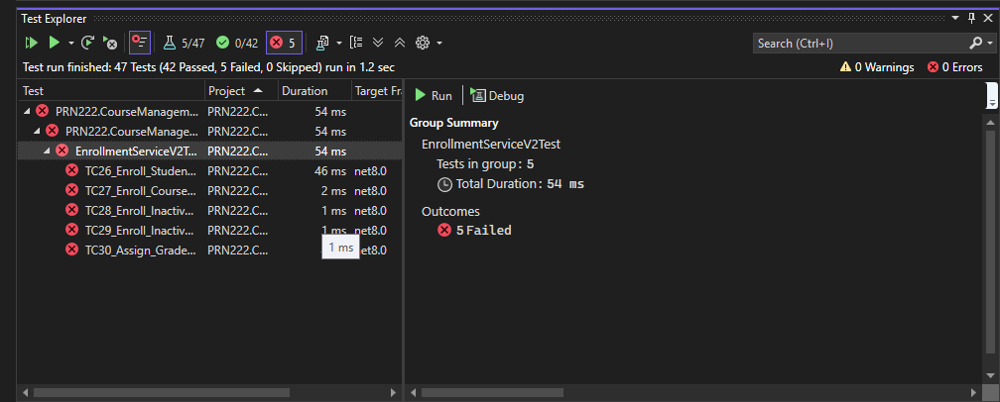

# PRN222 Course Management System

## 📌 Giới thiệu

Đây là dự án **Course Management System** được xây dựng trong học phần **PRN222**, áp dụng kiến trúc **Repository Pattern + Service Layer + Unit Of Work** và **Unit Test** để đảm bảo đúng Business Rules.

Hệ thống cho phép quản lý **Student – Course – Enrollment**, tập trung vào tính đúng đắn nghiệp vụ và khả năng mở rộng.

---

## 🏗️ Kiến trúc tổng thể

```
Presentation (Console / API / UI)
        ↓
Service Layer (Business Rules)
        ↓
Repository Layer
        ↓
Database
```

### Thành phần chính

* **Repository**: Truy cập dữ liệu (CRUD)
* **Service**: Xử lý nghiệp vụ (Business Rules)
* **UnitOfWork**: Quản lý transaction
* **ServiceResult**: Chuẩn hóa kết quả trả về
* **Unit Test (NUnit + Moq)**: Kiểm tra nghiệp vụ

---

## 📂 Cấu trúc thư mục

```
PRN222.CourseManagement
│
├── Repository
│   ├── Interfaces
│   ├── Implementations
│   └── UnitOfWork
│
├── Service
│   ├── Interfaces
│   ├── Implementations
│   └── BusinessRules
│
├── Domain
│   ├── Student.cs
│   ├── Course.cs
│   └── Enrollment.cs
│
├── ServiceTest
│   ├── CourseServiceTest.cs
│   ├── EnrollmentServiceTest.cs
│   └── StudentServiceTest.cs
│
└── README.md
```

---

## 📜 Business Rules

### Enrollment Rules

* **BR16**: A student cannot enroll in the same course more than once
* **BR17**: A student can enroll in a maximum of 5 courses
* **BR18**: Enrollment date cannot be in the past
* **BR19**: A student can enroll only in courses of the same department
* **BR20**: Enrollment must reference existing student and course

### Course Rules

* **BR14**: A course cannot be deleted if students are enrolled

---

## ✅ ServiceResult chuẩn

Mọi Service đều trả về `ServiceResult`:

* `IsSuccess`: Trạng thái thành công / thất bại
* `Message`: Thông báo nghiệp vụ

Giúp:

* Dễ test
* Không throw exception cho logic nghiệp vụ
* Thống nhất xử lý ở tầng trên

---

## 🧪 Unit Testing

* Framework: **NUnit**
* Mocking: **Moq**

### Nguyên tắc test

* 1 test = 1 Business Rule
* Tên test phản ánh đúng tình huống
* Mock đúng trạng thái dữ liệu

Ví dụ:

* `Delete_Course_HasEnrollments_Fail`
* `Delete_Course_NoEnrollments_Success`
* `Create_Enrollment_Duplicate_Fail`

---
## 🧪 Test Status – TDD Validation (EnrollmentServiceV2)

### Current Test Results


> 📸

* **Total tests:** 47
* **Passed:** 42 ✅
* **Failed:** 5 ❌
* **Skipped:** 0

All 5 failed tests belong to **EnrollmentServiceV2Test**, which is **expected and intentional** at this stage because the project is following **strict TDD (Test-Driven Development)**.

---

### ❌ Failed Test Cases (Business Rules – TDD Red Phase)

| Test Case | Description                         | Business Rule |
| --------- | ----------------------------------- | ------------- |
| TC26      | Enroll student under 18             | BR26          |
| TC27      | Enroll into course with 0 credits   | BR27          |
| TC28      | Enroll into inactive course         | BR28          |
| TC29      | Enroll inactive student             | BR29          |
| TC30      | Assign grade outside grading period | BR30          |

These tests are written **before implementing business logic**, therefore they are currently failing (**Red phase**).

---

### 🔁 TDD Workflow Applied

This project strictly follows the mandatory TDD process:

1. **Red** – Write unit tests for new business rules (currently failing)
2. **Green** – Implement minimum code to make tests pass
3. **Refactor** – Improve code quality while keeping all tests passing

⚠️ Writing production code before tests is **not allowed**.

---

### 📌 Next Steps

* Implement business rules BR26 → BR30 in the Service layer
* Ensure all failed tests pass (Green phase)
* Refactor service logic if needed

> The presence of failed tests at this stage confirms correct TDD implementation.


## 🚀 Cách chạy dự án

1. Clone repository
2. Restore packages
3. Run project chính (Console/API)
4. Run **ServiceTest** để kiểm tra nghiệp vụ

---

## 🎯 Mục tiêu dự án

* Áp dụng đúng **OOP + SOLID**
* Viết Service đúng Business Rule
* Unit Test rõ ràng, không mâu thuẫn
* Chuẩn bị nền tảng cho Web/API sau này

---

## 👨‍💻 Tác giả

**Cường Võ Văn**
PRN222 – Spring 2026

---

## 📎 Ghi chú

Dự án tập trung vào **logic nghiệp vụ** hơn UI. Có thể mở rộng sang:

* ASP.NET Core Web API
* MVC / Blazor
* Frontend React / Angular

---

✨ *Code sạch – Test rõ – Logic đúng* ✨
